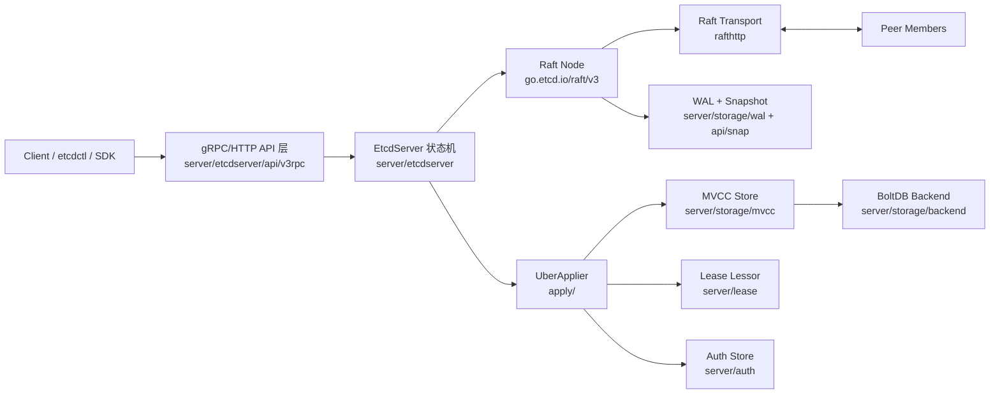
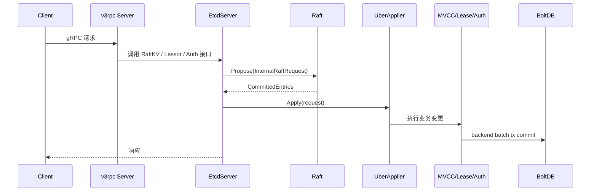

# etcd 架构文档（基于 `CancanPeng/etcd`）

## 1. 文档范围与基线

- 仓库地址：`https://github.com/CancanPeng/etcd`
- 本地分支：`master`
- 分析基线提交：`e8a01679234f2498c63a83bd2040b5510307ae1f`（`Merge branch 'etcd-io:main' into master`）
- 结论：该仓库当前基本对齐 etcd upstream 主线（3.6 开发周期），架构可按 etcd v3 主体理解。

## 2. 总体架构

etcd 是一个“Raft 一致性日志 + MVCC 键值引擎 + gRPC API”的分布式系统。

核心目标：
- 写请求通过 Raft 共识保证线性一致。
- 读请求区分线性一致读与可串行化读。
- 存储层通过 WAL + 快照 + BoltDB 保证恢复能力与持久性。

## 3. 模块与目录映射

按 `Documentation/contributor-guide/modules.md`，仓库采用多 module 组织：

- `api/`：协议定义（protobuf、pb 生成代码）
- `client/v3/`：Go 客户端
- `server/`：服务端实现（核心）
- `etcdctl/`：在线管理客户端
- `etcdutl/`：离线运维工具（快照、DB 操作等）
- `tests/`：集成、e2e、鲁棒性测试

服务端核心子模块：

- `server/etcdmain`：命令行入口编排
- `server/embed`：进程内嵌模式（listener、server lifecycle）
- `server/etcdserver`：状态机与 Raft 结合点
- `server/etcdserver/api/v3rpc`：KV/Watch/Lease/Auth/Maintenance 的 gRPC 暴露
- `server/etcdserver/api/rafthttp`：节点间 Raft 消息传输
- `server/storage/mvcc`：多版本键值存储、watch 机制
- `server/storage/backend`：BoltDB 后端
- `server/storage/wal`：预写日志
- `server/lease`：租约与 TTL
- `server/auth`：认证鉴权

## 4. 启动与生命周期

### 4.1 启动主链路

1. `server/main.go` 调用 `etcdmain.Main(os.Args)`。
2. `server/etcdmain/etcd.go:startEtcdOrProxyV2` 解析参数、检查 data-dir、决定启动 etcd。
3. `server/embed/etcd.go:StartEtcd`：
   - 校验配置
   - 初始化 peer/client/metrics listener
   - 组装 `config.ServerConfig`
   - 调用 `etcdserver.NewServer`
4. `server/etcdserver/server.go:NewServer`：
   - bootstrap（WAL、snapshot、backend、cluster、raft）
   - 初始化 `lessor`、`mvcc`、`authStore`、`uberApplier`
   - 启动 rafthttp transport
5. `EtcdServer.Start()` 启动后台循环：
   - `run()`（Raft apply 主循环）
   - `linearizableReadLoop`
   - compaction / 版本监控 / 降级监控 / 文件清理等

### 4.2 关闭流程

`embed.Etcd.Close()` 包含“先停接入、再停 server、再停 peer 通道、最后收尾”的顺序化关闭，降低中断时损坏风险。

## 5. 一致性与请求处理模型

## 5.1 写请求路径（Put/Delete/Txn/Lease/Auth 等）

关键点：
- `v3_server.go:processInternalRaftRequestOnce` 把请求封装为 `InternalRaftRequest` 并 `Propose`。
- `server.go:run -> applyAll -> applyEntries` 消费 committed entries。
- `apply/uber_applier.go` 统一分发到 Put/Txn/Lease/Auth 等具体处理器。

## 5.2 线性一致读路径

- 非串行化读会走 `linearizableReadNotify`。
- `linearizableReadLoop` 通过 `ReadIndex` 与 leader 对齐读取点。
- 等待 `appliedIndex >= confirmedIndex` 后放行，保证线性一致。

涉及实现：`server/etcdserver/v3_server.go`（`linearizableReadLoop`、`requestCurrentIndex`）。

## 5.3 Watch 路径

- `api/v3rpc/watch.go` 维护双循环：
  - recv loop：处理 create/cancel/progress 控制消息
  - send loop：从 `mvcc.WatchStream` 推送事件
- watch 的事件源来自 `mvcc/watchable_store`。

## 6. Raft 与复制通道

- Raft 库：`go.etcd.io/raft/v3`（外部独立模块）
- 本地桥接：`server/etcdserver/raft.go`
  - 消费 `Ready()`
  - 先落盘（snapshot/WAL/hardstate）
  - leader 发送消息到 peers
  - 通过 `applyc` 把可应用条目送入状态机
- 网络传输：`api/rafthttp/transport.go`
  - endpoint：`/raft`、`/raft/stream`、`/raft/snapshot`
  - 支持 peer/remotes（正常成员与追赶成员）

## 7. 存储架构

## 7.1 存储分层

- 日志层：`storage/wal`
  - 追加写 + segment（默认 64MB）
  - metadata/state/snapshot/entry record
- 状态快照层：`api/snap` + backend snapshot
- 状态数据库层：`storage/backend`（BoltDB）
- 逻辑数据层：`storage/mvcc`
  - revision、索引、compact、hash 校验

## 7.2 MVCC 设计要点

- 每次写入推进 revision，支持历史版本读取。
- `compact` 清理旧 revision，控制存储膨胀。
- watch 基于 revision 增量分发事件。
- `kvstore` 中 `currentRev` 与 `compactMainRev` 维护可见版本边界。

## 7.3 恢复机制

`bootstrap` 与 `applySnapshot` 路径确保：
- 可从 WAL + snapshot 恢复 raft 状态
- 可从 snapshot backend 恢复 mvcc/lease/auth/membership
- 恢复后重建 transport peers

## 8. 集群成员与运维接口

- 成员管理：`api/membership`
- peer HTTP：`api/etcdhttp/peer.go`
  - `/members`、`/members/promote/{id}`
  - `/raft*`、`/leases*`、版本与降级状态接口
- 运维工具：
  - `etcdctl`：在线 API 操作
  - `etcdutl`：离线快照/DB/defrag/hashkv

## 9. 安全模型

- 传输安全：peer/client 双向 TLS 可配置（`embed` listener 初始化）
- 身份与权限：`server/auth`
  - user/role/permission
  - token provider（simple/JWT）
  - 请求前鉴权、范围权限检查
- mTLS 身份可映射 auth 信息（`AuthInfoFromTLS`）

## 10. 可观测性与可靠性机制

- Prometheus 指标：gRPC、raft、backend、txn、watch 等多维指标
- tracing：支持 OpenTelemetry（可开关）
- 防护机制：
  - 请求大小限制、并发流限制
  - apply/commit gap 限流（过载保护）
  - hash/corruption 检查
  - 启动时初始一致性检查（feature gate）
- 测试体系：
  - `tests/integration`、`tests/e2e`
  - `tests/robustness`（故障注入、模型校验）
  - `tests/antithesis`（对抗性场景）

## 11. 一页式结论

etcd 的实现是“共识优先”的分层架构：

- **控制面**：Raft + membership + transport 维持集群一致状态推进。
- **数据面**：MVCC + backend 提供事务语义、历史版本与 watch。
- **接入面**：v3 gRPC API 把业务请求映射为可复制的内部 raft 请求。
- **运维面**：etcdctl/etcdutl + 指标/追踪/鲁棒测试保证可运营性。

对于二次开发，优先关注这些稳定扩展点：
- gRPC 拦截器与 API 层（`api/v3rpc`）
- apply 链路包装器（`apply/*`）
- feature gate（`server/features` + config）

而不建议直接修改：
- raft ready/apply 并发时序
- WAL/snapshot 恢复序列
- linearizable read 主循环

这些路径对一致性和恢复正确性最敏感。

## 12. 关键源码索引

- 入口：`server/main.go`，`server/etcdmain/main.go`，`server/etcdmain/etcd.go`
- 嵌入启动：`server/embed/etcd.go`
- 核心状态机：`server/etcdserver/server.go`，`server/etcdserver/v3_server.go`
- Raft 适配：`server/etcdserver/raft.go`
- 应用分发：`server/etcdserver/apply/uber_applier.go`
- gRPC API：`server/etcdserver/api/v3rpc/*.go`
- Peer HTTP / 传输：`server/etcdserver/api/etcdhttp/peer.go`，`server/etcdserver/api/rafthttp/transport.go`
- 存储：`server/storage/backend/backend.go`，`server/storage/mvcc/kvstore.go`，`server/storage/wal/wal.go`
- 租约与鉴权：`server/lease/lessor.go`，`server/auth/store.go`
- 模块说明：`Documentation/contributor-guide/modules.md`
